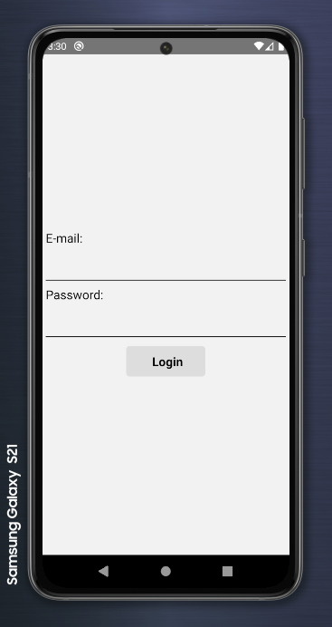
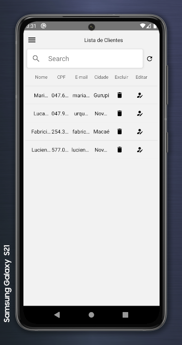
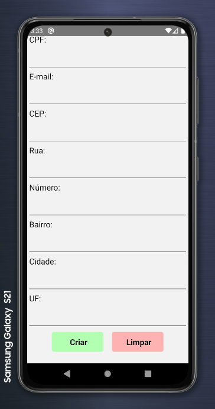
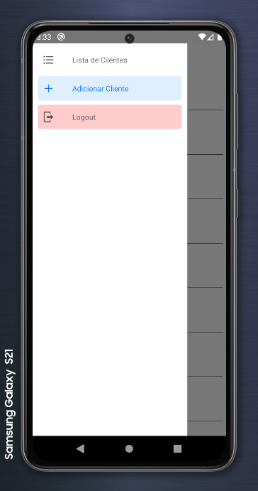

# Crud Client :chart_with_upwards_trend:

## Projeto criado com React-Native e outras dependências

### Foi utilizado nesse projeto:

* #### [React-Native](https://reactnative.dev/)

* #### [React Navigation](https://reactnavigation.org/)

* #### [Axios](https://github.com/axios/axios)

* #### [Async Storage](https://github.com/react-native-async-storage/async-storage)

* #### [React Native Masked Text](https://github.com/benhurott/react-native-masked-text)

* #### [Styled Components](https://styled-components.com/)

* #### [Native Paper](https://callstack.github.io/react-native-paper/)


## Tutorial de Execução

### Para instalação do json-server:

#### `npm install -g json-server`


### Na raiz do projeto apague o conteúdo do arquivo db.json e coloque dentro o seguinte:

```
  {
    "usuarios": [
      {
        "email":"teste@emaill.com.br",
        "password": "123456"
      }
    ]
  },
  {
    "clientes": []
  }
```


### Logo após execute o comando:

#### `json-server --watch db.json --delay 2000 --port 5000`


### Em outro terminal execute o comando:

#### `yarn start`


### Depois em outro terminal execute:

#### `npx react-native run-android`


### Prints da Aplicação

#### Tela de Login




#### Tela de Listagem de Cliente




#### Tela de Adicionar Clientes




#### Drawer


